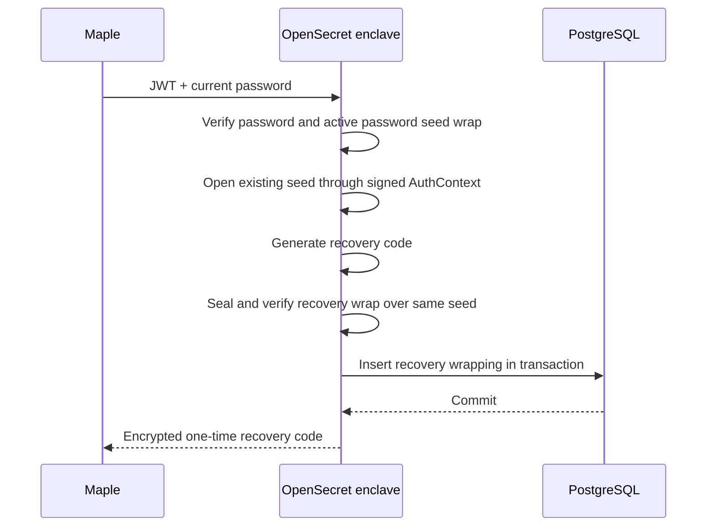
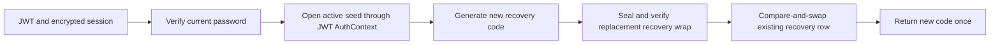
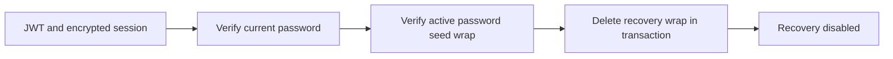
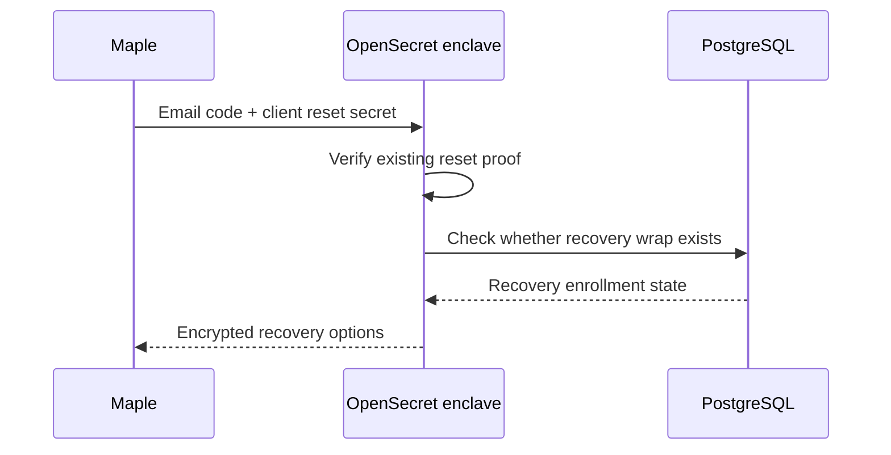
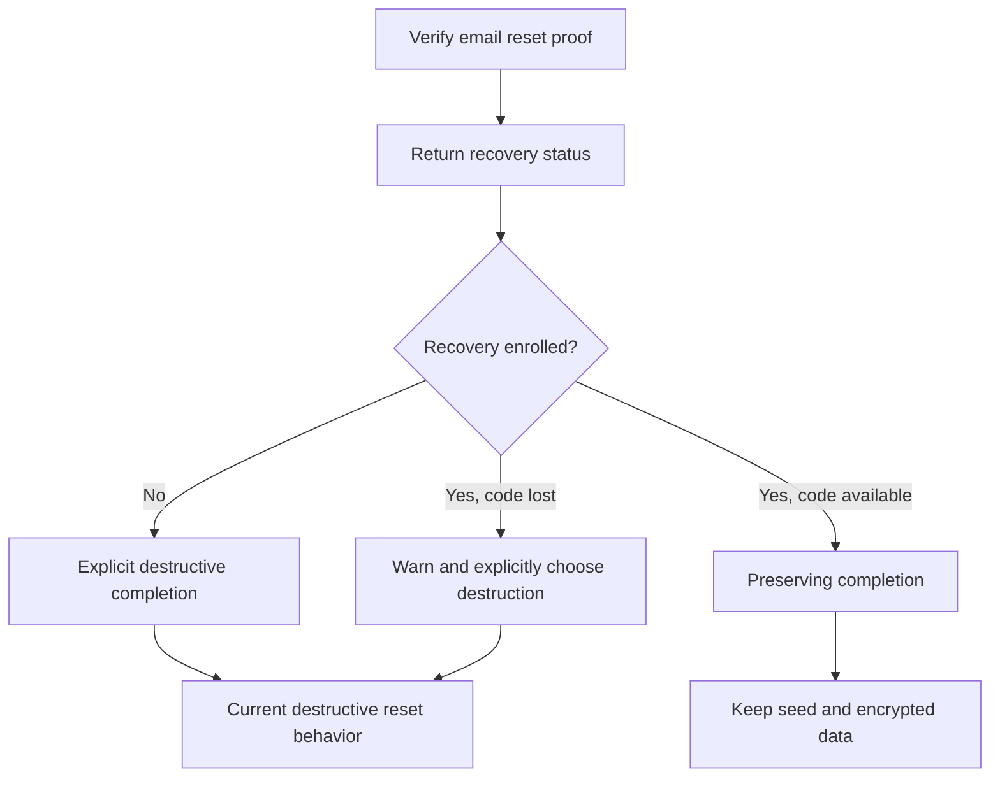
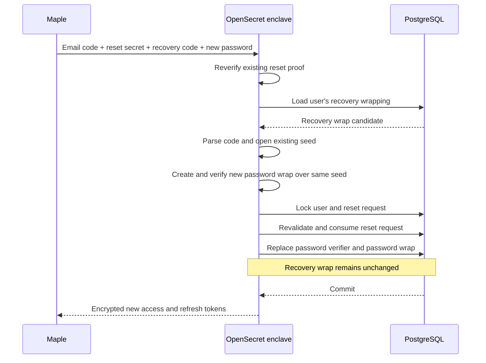

# Recovery Code Implementation Plan

> **Implementation follow-up:** The local encrypted-HTTP recovery flow and log
> scan now pass; see [the smoke runner guide](dev-shell.md#recovery-credential-smoke).
> Phase 8 counts and the carrier deferral below are historical evidence from the
> original implementation. Follow-up fixes add user-lock/password-snapshot checks, strict completion
> payloads, a 256-byte input limit, bounded recovery envelopes/database reads,
> and mutation-time reset expiry/proof checks. Registered guests with valid JWTs
> can read an unenrolled status but cannot enroll, rotate, or disable recovery.

Recovery reads are owned by `UserSeedWrapping::get_recovery_for_user`. It uses
the caller's connection, bounds the query, and rejects duplicate slots or invalid
stored sizes with a typed storage-integrity error. Lookup hashes must be exactly
32 bytes; envelopes must be between the 28-byte nonce/tag minimum and 243 bytes.
These structural size checks precede AEAD/mnemonic validation. Invalid stored
sizes return a sanitized server error without consuming reset proof; they are
not treated as wrong recovery-code guesses.

## Scope

OpenSecret already supports credential-bound seed wraps for password and OAuth authentication. Password change rewraps the existing seed; password reset creates a new seed and deletes old seed-dependent state.

V1 adds a recovery credential kind to `user_seed_wrappings`. It does not otherwise redesign authentication, password-reset request handling, destructive-reset cleanup, OAuth, API keys, or token revocation.

## Implementation Status

Phases 0–8 are complete on branch `docs/recovery-credential-architecture`. The
implementation is backend-only and backwards compatible, and it rolls out
**silently**: the additive endpoints are unused by clients that do not expose
the feature, so nothing about existing client behavior changes. Recovery SDK
bindings and the Maple Security settings UI are the later client-rollout
milestone (see Frontend Rollout).

Validation evidence (Phase 8 integration gate; local Nix dev shell, disposable
loopback Postgres created and removed by the validation helper):

- `cargo fmt --all -- --check`, `cargo check --locked --all-features`, and the
  exact CI gate `cargo clippy --locked --all-targets --all-features --
  -D warnings` (with `RUSTFLAGS='-D warnings'`) → clean.
- `cargo test --locked --all-features` → 683 passed / 0 failed / 54 ignored.
- Disposable fresh-database run (isolated cluster, identity + empty-schema
  checks, full migration chain, down/up redo of
  `2026-09-03-000000_recovery_credential_kind`, all DB-backed ignored suites
  serially) → 20 AEAD-tamper + 2 OAuth + 31 recovery = 53 passed / 0 failed /
  0 skipped; temporary cluster removed.
- `security_invariants` focused run → 27 passed / 0 failed.
- Component `nix flake check --no-update-lock-file` → all checks passed;
  `nix build --no-link --no-update-lock-file '.?submodules=1#default'` → success.
- Owned dev database: `just diesel-migration-run-local` → no pending migrations.

Deliberately not exercised: an encrypted-v2-carrier SDK smoke test and runtime
log capture. The transport carrier is pre-existing, separately tested shared
code, route wiring is pinned by `security_invariants`, and log hygiene is
statically scanned (`security_invariants`) plus source-audited: the recovery
crypto and database modules contain no log macros, `RecoveryCode` cannot be
formatted, and every recovery log site carries only generic failure messages
or user UUIDs. The encrypted client smoke becomes part of the client-rollout
gate when SDK/GUI consumption starts.

## V1 Decisions

- One active recovery code per user.
- Recovery codes are opt-in from Maple's Security settings.
- Maple controls frontend rollout; no enclave/backend feature flag is required.
- V1 supports email-backed password users. Guest and OAuth-only recovery are deferred.
- The enclave generates 256 random bits and formats them as grouped Crockford Base32 with a 40-bit checksum.
- The code is visually distinct from a BIP-39 mnemonic and is shown only in an encrypted response.
- Enrollment activates the code immediately. The user does not re-enter it.
- Successful preserving recovery keeps the existing recovery code active.
- Rotation is explicit and requires an authenticated session plus current-password verification.
- Authenticated users may disable recovery with current-password verification; the current recovery code is not required.
- The legacy one-shot password reset remains destructive and never reads recovery state or uses recovery material.
- A legacy reset request containing a `recovery_code` field is rejected before project, user, reset-request, or recovery lookup.
- The additive v2 reset flow verifies the existing email code and client reset secret before reporting whether recovery is enrolled. The client resubmits the same proof when completing the chosen reset mode.
- A malformed or checksum-invalid recovery code does not consume the reset request. A well-formed code that fails authenticated seed unwrap consumes the selected reset request through the same guarded update pattern used by successful reset.
- Current reset-request creation semantics remain unchanged: multiple unexpired reset requests may coexist until one reset succeeds.
- Password reset without a recovery code remains destructive exactly as today and leaves recovery disabled afterward.
- V1 does not add broad OAuth or API-key revocation beyond current behavior.
- All recovery endpoints (management and v2 reset) require a **v2 transport session**. V1 callers are rejected before any application logic runs.
- Complete, internally consistent database rollback remains outside the v1 threat model.

## Data Model

Extend the current credential kind:

```rust
enum CredentialKind {
    Password,
    OAuth,
    Recovery,
}

impl CredentialKind {
    fn as_str(self) -> &'static str {
        match self {
            Self::Password => "password",
            Self::OAuth => "oauth",
            Self::Recovery => "recovery",
        }
    }
}
```

Add a migration that extends the existing check constraint:

```sql
CHECK (credential_kind IN ('password', 'oauth', 'recovery'))
```

Reuse `user_seed_wrappings` without adding a recovery table:

```rust
struct UserSeedWrapping {
    id: i64,
    user_id: Uuid,
    credential_kind: String,
    credential_lookup_hash: Vec<u8>,
    wrapping_version: i16,
    seed_enc: Vec<u8>,
    created_at: DateTime<Utc>,
    updated_at: DateTime<Utc>,
}
```

For recovery, `credential_lookup_hash` identifies the user's single recovery slot. It is an enclave-keyed, domain-separated value derived from stable account context, not from the recovery secret:

```rust
fn recovery_credential_lookup_hash(
    enclave_root: &[u8],
    project_id: i32,
    user_id: Uuid,
) -> CredentialLookupHash;
```

The existing unique index then enforces one recovery wrap per user and wrapping version.

## Recovery Code

```rust
struct RecoveryCode {
    secret: Zeroizing<[u8; 32]>,
}

impl RecoveryCode {
    async fn generate(credentials: AwsCredentialManager) -> Self;
    fn parse(input: &str) -> Result<Self, RecoveryCodeError>;
    fn display(&self) -> Zeroizing<String>;
}
```

Canonical display shape:

```text
MPLRC1-XXXX-XXXX-XXXX-XXXX-XXXX-XXXX-XXXX-XXXX-XXXX-XXXX-XXXX-XXXX-XXXX-CCCC-CCCC
```

- `MPLRC1` identifies the Maple recovery-code display format.
- `X` groups encode the 256-bit secret using Crockford Base32.
- `C` groups encode a 40-bit checksum over the version and secret.
- Parsing is ASCII case-insensitive and ignores only ASCII spaces and hyphens.
- Reject invalid characters, length, version, padding, and checksum before database work.
- The recovery code never enters a path, query string, log, metric, email, AAD, or database column.

## Recovery Seed Wrap

> **Implemented shape (reconciled at Phase 6):** recovery wraps reuse the
> existing seed-wrap envelope representation — `encrypt_seed_v1` /
> `decrypt_seed_v1` with `CredentialKind::Recovery` and a recovery-specific
> `AuthBinding` from `compute_recovery_auth_binding` (domain
> `os.recovery-auth-binding.v1`), which HMACs the user, project, and the
> SHA-256 of the recovery secret into the binding. There is no separate
> recovery-wrap key/AAD envelope representation; the `recovery_wrap_key` /
> `recovery_wrap_aad` sketch below was never shipped and was deleted at
> Phase 6. The AEAD tag remains the only correctness check for a submitted
> code, so opening stays fail-closed.
>
> Every newly created recovery wrap must still be opened and compared
> byte-for-byte with the intended seed before persistence
> (`verify_recovery_seed_wrapping`), and the reset completion validates the
> opened seed as a mnemonic before any mutation.

Original sketch, retained for history:

```text
12-byte nonce || ciphertext || 16-byte GCM tag
```

```rust
const RECOVERY_WRAP_ROOT_INFO: &[u8] = b"os.recovery-wrap-root.v1";
const RECOVERY_WRAP_KEY_INFO: &[u8] = b"os.recovery-wrap-aead-key.v1";
const RECOVERY_WRAP_DOMAIN: &str = "os.recovery-wrap.v1";

fn recovery_wrap_key(
    enclave_root: &[u8],
    recovery_secret: &[u8; 32],
) -> AeadKey {
    let root = hkdf(enclave_root, RECOVERY_WRAP_ROOT_INFO);
    hkdf_with_salt(&root, recovery_secret, RECOVERY_WRAP_KEY_INFO)
}

fn recovery_wrap_aad(
    user_id: Uuid,
    project_id: i32,
    wrapping_version: i16,
) -> Vec<u8> {
    CanonicalBytes::new(RECOVERY_WRAP_DOMAIN)
        .append_uuid(user_id)
        .append_i32(project_id)
        .append_str(CredentialKind::Recovery.as_str())
        .append_i16(wrapping_version)
        .into_bytes()
}
```

The enclave root and recovery secret are both required to open the envelope. User, project, credential kind, and wrapping version are authenticated through trusted AAD.

Every newly created recovery wrap must be opened and compared byte-for-byte with the intended seed before persistence.

Bound `seed_enc` before copying or decrypting it. Derive the exact maximum from the accepted mnemonic length plus nonce and tag.

## API Types

Names and paths may be adjusted with the SDK/Maple implementation, but the contracts should remain additive.

```rust
struct RecoveryStatusResponse {
    enrolled: bool,
    enrolled_at: Option<DateTime<Utc>>,
}

struct EnrollRecoveryRequest {
    current_password: String,
}

struct EnrollRecoveryResponse {
    recovery_code: String,
}

struct RotateRecoveryRequest {
    current_password: String,
}

struct RotateRecoveryResponse {
    recovery_code: String,
}

struct DisableRecoveryRequest {
    current_password: String,
}

#[derive(Clone)]
struct PasswordResetV2Proof {
    email: String,
    alphanumeric_code: String,
    plaintext_secret: String,
    client_id: Uuid,
}

struct PasswordResetV2OptionsRequest {
    proof: PasswordResetV2Proof,
}

struct PasswordResetV2OptionsResponse {
    recovery_enrolled: bool,
    destructive_reset_available: bool,
}

enum CompletePasswordResetMode {
    Preserve {
        recovery_code: String,
    },
    Destructive {
        acknowledge_data_loss: bool,
    },
}

struct CompletePasswordResetV2Request {
    proof: PasswordResetV2Proof,
    new_password: String,
    mode: CompletePasswordResetMode,
}

struct CompletePasswordResetV2Response {
    message: String,
    access_token: String,
    refresh_token: String,
}
```

Proposed routes:

```text
GET  /protected/recovery-code            (v2 transport only)
POST /protected/recovery-code/enroll      (v2 transport only)
POST /protected/recovery-code/rotate      (v2 transport only)
DELETE /protected/recovery-code          (v2 transport only)

POST /password-reset/v2/options           (v2 transport only)
POST /password-reset/v2/complete          (v2 transport only)
```

Protected recovery management requires a user JWT and an encrypted **v2 transport session**. API keys cannot enroll or rotate recovery.

### Transport Requirement

Recovery endpoints are reachable through the v2 gateway only. The handler layer can enforce this without duplicating the check in every function by adding a `require_transport_v2` middleware to the recovery sub-router:

```rust
fn require_transport_v2(
    req: Request<Body>,
    next: Next,
) -> Result<Response, ApiError> {
    if !req
        .extensions()
        .get::<TransportSession>()
        .is_some_and(TransportSession::is_v2)
    {
        return Err(ApiError::BadRequest);
    }
    Ok(next.run(req).await)
}
```

Applied as a route layer:

```rust
let recovery = Router::new()
    .route("/recovery-code", get(recovery_status))
    .route("/recovery-code/enroll", post(enroll_recovery))
    .route("/recovery-code/rotate", post(rotate_recovery))
    .route("/recovery-code", delete(disable_recovery))
    .route_layer(from_fn(require_transport_v2))
    .route_layer(from_fn_with_state(app_state.clone(), validate_jwt));
```

The v2 reset endpoints are similarly layered under the unauthenticated reset router. Individual handlers still inspect `TransportSession::is_v2()` for defense-in-depth, but the middleware guarantees that legacy v1 sessions cannot reach recovery logic.

## Enrollment

Enrollment is available only when no recovery wrap exists.



Rust-like flow:

```rust
async fn enroll_recovery(
    Extension(session): Extension<TransportSession>,
    user: User,
    auth_context: AuthContext,
    current_password: String,
) -> Result<RecoveryCode, ApiError> {
    if !session.is_v2() {
        return Err(ApiError::BadRequest);
    }
    require_email_password_user(&user)?;
    reauthenticate_password(&user, current_password).await?;

    let seed = decrypt_seed_for_auth_context(&user, &auth_context)?;
    ensure_no_recovery_wrap(user.uuid)?;

    let code = RecoveryCode::generate(...).await;
    let wrapping = new_recovery_seed_wrapping(&user, &code, &seed)?;
    verify_recovery_seed_wrapping(&user, &code, &seed, &wrapping)?;

    insert_recovery_wrap_if_absent(wrapping)?;
    Ok(code)
}
```

The insert must fail on a concurrent enrollment rather than silently replacing the winner.

## Manual Rotation

Rotation replaces the existing recovery wrap and returns a new code. The current recovery code is not required because the authenticated user proves control with their current password and active password seed wrap.



```rust
async fn rotate_recovery(
    Extension(session): Extension<TransportSession>,
    user: User,
    auth_context: AuthContext,
    current_password: String,
) -> Result<RecoveryCode, ApiError> {
    if !session.is_v2() {
        return Err(ApiError::BadRequest);
    }
    require_email_password_user(&user)?;
    reauthenticate_password(&user, current_password).await?;

    let seed = decrypt_seed_for_auth_context(&user, &auth_context)?;
    let old = get_recovery_wrap(user.uuid)?.ok_or(ApiError::BadRequest)?;
    let code = RecoveryCode::generate(...).await;
    let replacement = new_recovery_seed_wrapping(&user, &code, &seed)?;
    verify_recovery_seed_wrapping(&user, &code, &seed, &replacement)?;

    replace_recovery_wrap_if_unchanged(old, replacement)?;
    Ok(code)
}
```

Future MFA may replace or supplement current-password step-up.

## Disable Recovery

Disablement deletes the recovery wrap. It requires the same authenticated current-password step-up as rotation, but does not require the recovery code.



```rust
async fn disable_recovery(
    Extension(session): Extension<TransportSession>,
    user: User,
    auth_context: AuthContext,
    current_password: String,
) -> Result<(), ApiError> {
    if !session.is_v2() {
        return Err(ApiError::BadRequest);
    }
    require_email_password_user(&user)?;
    reauthenticate_password(&user, current_password).await?;
    verify_seed_wrap_for_auth_context(&user, &auth_context)?;
    delete_recovery_wrap_for_user(user.uuid)?;
    Ok(())
}
```

The operation is idempotent at the API boundary. A concurrent preserving reset must either observe the recovery wrap and commit before disablement, or fail its unchanged-row check.

## V2 Reset Options

The existing API has no global version prefix. `v2` is scoped to the reset flow so it can coexist with the legacy one-shot endpoint.

V2 first verifies the existing email reset proof. Only then does it reveal whether recovery is enrolled. The options request is read-only: it does not consume or modify the reset request. Completion resubmits and reverifies the same proof before performing either preserving or destructive reset.

No continuation token, table, enclave-local state, sticky-routing dependency, or new bearer capability is needed.

### Get Reset Options



```rust
async fn password_reset_v2_options(
    Extension(session): Extension<TransportSession>,
    request: PasswordResetV2OptionsRequest,
) -> Result<PasswordResetV2OptionsResponse, ApiError> {
    if !session.is_v2() {
        return Err(ApiError::BadRequest);
    }
    let (user, _reset_request) = verify_existing_reset_proof(
        request.proof.email,
        request.proof.alphanumeric_code,
        request.proof.plaintext_secret,
        request.proof.client_id,
    )?;

    Ok(PasswordResetV2OptionsResponse {
        recovery_enrolled: recovery_wrap_exists(user.uuid)?,
        destructive_reset_available: true,
    })
}
```

The response reveals recovery status only to a caller that presents the valid email code and matching client reset secret. Other unexpired reset requests retain current behavior. The reset proof may be submitted to `/options` repeatedly until it expires, is consumed by completion, or another successful reset consumes all active requests.

## V2 Completion

Maple uses `recovery_enrolled` to show an informed choice:

- If recovery is enrolled, offer seed-preserving recovery first and explain that destructive reset deletes encrypted data.
- If recovery is not enrolled, offer only destructive reset.
- If the user lost the recovery code, destructive reset remains an explicit option.



### Preserving Completion

This flow reverifies the email reset proof and recovery code, opens the existing seed, and creates a new password wrap over that same seed. The recovery wrap remains unchanged.



```rust
async fn complete_preserving_password_reset_v2(
    Extension(session): Extension<TransportSession>,
    reset_proof: PasswordResetV2Proof,
    recovery_code_input: String,
    new_password: String,
) -> Result<AuthResponse, ApiError> {
    if !session.is_v2() {
        return Err(ApiError::BadRequest);
    }
    let (user, reset_request) = verify_existing_reset_proof(
        reset_proof.email,
        reset_proof.alphanumeric_code,
        reset_proof.plaintext_secret,
        reset_proof.client_id,
    )?;

    let recovery_code = RecoveryCode::parse(&recovery_code_input)?;
    let recovery_wrap = get_recovery_wrap(user.uuid)?
        .ok_or(ApiError::BadRequest)?;

    let seed = decrypt_recovery_seed(&user, &recovery_code, &recovery_wrap)
        .map_err(|_| ApiError::BadRequest)?;
    validate_mnemonic(&seed)?;

    let new_password = new_password_verifier_and_wrap(&user, new_password, &seed).await?;
    verify_new_password_wrap(&user, &new_password, &seed)?;

    complete_preserving_password_reset(
        &user,
        &reset_request,
        &recovery_wrap,
        new_password,
    )?;

    issue_tokens_for_new_password_context(user, new_password.auth_context)
}
```

The transaction must:

1. Lock the user and selected reset request.
2. Recheck that the reset request is unused, unexpired, and still matches the client reset secret.
3. Recheck that the recovery wrap is unchanged from the opened candidate.
4. Consume the selected reset request and all other active reset requests for the user.
5. Replace the encrypted password verifier and password wrap.
6. Leave the recovery wrap, OAuth behavior, API keys, and seed-key-encrypted data unchanged.

Maple should validate format and checksum locally. The enclave independently parses and validates before database work:

```rust
match RecoveryCode::parse(&input) {
    Err(InvalidFormat | InvalidChecksum) => {
        // Return a stable input error; reset request remains usable.
    }
    Ok(code) => match decrypt_recovery_seed(...) {
        Ok(seed) => complete_preserving_reset(...),
        Err(_) => consume_reset_request_and_return_bad_request(...),
    }
}
```

`consume_reset_request_and_return_bad_request` uses the existing guarded reset-row update shape:

```rust
let updated = diesel::update(
    password_reset_requests::table
        .filter(password_reset_requests::id.eq(reset_request.id))
        .filter(password_reset_requests::user_id.eq(user.uuid))
        .filter(password_reset_requests::is_reset.eq(false))
        .filter(password_reset_requests::expiration_time.gt(diesel::dsl::now)),
)
.set(password_reset_requests::is_reset.eq(true))
.execute(conn)?;

if updated != 1 {
    return Err(DBError::PasswordResetRequestNotFound);
}
```

This consumes only the selected request. It does not change the password, wraps, recovery enrollment, other reset requests, or user data. A correct completion racing the failed attempt uses the same guarded predicate in its final transaction, so exactly one operation wins.

Public errors must not disclose account identity, database state, or whether the submitted well-formed secret was close to correct.

### Explicit Destructive Completion

```rust
async fn complete_destructive_password_reset_v2(
    Extension(session): Extension<TransportSession>,
    reset_proof: PasswordResetV2Proof,
    new_password: String,
    acknowledge_data_loss: bool,
) -> Result<CompletePasswordResetV2Response, ApiError> {
    if !session.is_v2() {
        return Err(ApiError::BadRequest);
    }
    if !acknowledge_data_loss {
        return Err(ApiError::BadRequest);
    }

    let (user, reset_request) = verify_existing_reset_proof(
        reset_proof.email,
        reset_proof.alphanumeric_code,
        reset_proof.plaintext_secret,
        reset_proof.client_id,
    )?;
    complete_existing_destructive_reset(&user, &reset_request, new_password).await
}
```

The transaction consumes the selected and all other active reset requests, then runs the existing destructive cleanup and new-seed/password-wrap creation. It does not create a recovery wrap.

## Legacy Destructive Password Reset

> **Implemented shape (reconciled at Phase 7):** the guard field is
> presence-aware — `recovery_code: Option<Option<String>>` with a custom
> `deserialize_with` in `PasswordResetConfirmPayload` — so the handler rejects
> every present form of the field, including an explicit `null`, where the
> `Option<String>` sketch below would have treated `null` as absent and let
> the payload through to the destructive reset. The old-client shape (field
> absent) deserializes unchanged and proceeds with the destructive reset, and
> the endpoint still never parses, inspects, or mutates recovery state.

The existing `/password-reset/confirm` flow remains one-shot and destructive. It continues to generate a new seed, delete old wraps and seed-key-encrypted state, disconnect OAuth, preserve API keys, and install a new password wrap exactly as today. It does not inspect recovery enrollment and does not create a recovery wrap.

Add only an early guard so recovery material cannot be accidentally sent to the destructive endpoint:

```rust
struct PasswordResetConfirmPayload {
    email: String,
    alphanumeric_code: String,
    plaintext_secret: String,
    new_password: String,
    client_id: Uuid,
    #[serde(default)]
    recovery_code: Option<String>,
}

async fn password_reset_confirm(payload: PasswordResetConfirmPayload) -> Result<..., ApiError> {
    if payload.recovery_code.is_some() {
        return Err(ApiError::BadRequest);
    }

    // Existing handler behavior follows unchanged.
}
```

The guard runs before project, user, reset-request, or recovery lookup. Existing clients omit the field and retain current behavior. V2 is the only flow that parses or uses recovery codes.

## Concurrency Rules

- Enrollment inserts only if no recovery wrap exists.
- Rotation replaces only the exact recovery row observed before encryption.
- Disablement and preserving reset have a defined one-winner race.
- V2 options is read-only and does not consume reset state.
- V2 completion commits only if the repeated reset proof and opened recovery row are still current.
- Password change, recovery reset, destructive reset, enrollment, rotation, and disablement must use a consistent user-row lock/CAS order.
- New wraps are verified before entering the transaction.
- No unwrap failure generates a seed or falls through to destructive reset.

## Implemented Surface

File map of the shipped implementation (design sections above; tests below):

| Concern | Location |
| --- | --- |
| Recovery code crypto: `RecoveryCode` (generate/parse/display), fieldless `RecoveryCodeError` | `src/recovery_code.rs` |
| Recovery `AuthBinding`, lookup hash, seal/verify helpers | `src/seed_wrapping.rs` (`compute_recovery_auth_binding`, `recovery_credential_lookup_hash`, `new_recovery_seed_wrapping`, `verify_recovery_seed_wrapping`) |
| Wrap CRUD + preserving-reset transaction | `src/db.rs` (`get_recovery_wrap`, `insert_recovery_wrap_if_absent`, `replace_recovery_wrap_if_unchanged`, `delete_recovery_wrap_for_user`, `recovery_wrap_exists`, `consume_selected_password_reset_request`, `complete_preserving_password_reset`) |
| Management routes + guards | `src/web/protected_routes.rs` (`recovery_router`, `recovery_status`, `enroll_recovery`, `rotate_recovery`, `disable_recovery`, `require_email_password_user`, `require_current_password`, `seed_for_recovery_management`) |
| V2 reset routes + error maps | `src/web/login_routes.rs` (`password_reset_v2_router`, `password_reset_v2_options`, `password_reset_v2_complete`, `map_reset_proof_error`, `map_preserving_completion_error`) |
| Preserving completion orchestration + `InvalidRecoveryCode` / `RecoveryNotEnrolled` | `src/main.rs` (`complete_preserving_password_reset_v2`) |
| Transport gate | `src/web/encryption_middleware.rs` (`require_transport_v2`, `require_v2_transport_session`) |
| Legacy guard | `src/web/login_routes.rs` (`password_reset_confirm`, `deserialize_recovery_code_presence`) |
| DB lifecycle tests (8, ignored) | `src/recovery_db_tests.rs` |
| Route tests (23, ignored): 7 management + 4 v2 options + 10 v2 completion + 2 legacy guard | `src/recovery_route_tests.rs` |
| Static pins + sensitive-log scanner | `src/security_invariants.rs` |

Router layer order on `recovery_router` and the v2 reset sub-router: per-route
`decrypt_request`, then `validate_jwt` (management only), with
`require_transport_v2` outermost at runtime, so v1/missing sessions are
rejected before JWT validation touches the database; handlers re-check
`require_v2_transport_session` as defense-in-depth. The v2 completion mode
enum is externally tagged snake_case:
`{"preserve":{"recovery_code":"…"}}` /
`{"destructive":{"acknowledge_data_loss":true}}`.

## Focused Tests

All of the following are implemented and passing as of the Phase 8 gate (see
Implementation Status).

### Cryptography

- Recovery code format/checksum vectors and normalization.
- Recovery wrap round trip.
- Wrong recovery code rejection.
- Ciphertext, nonce, tag, AAD, root-key, user, project, kind, and version substitution rejection.
- Password/OAuth/recovery domain separation.
- Oversized or malformed envelope rejection before decryption.

### Database lifecycle

- Enrollment creates one recovery wrap over the existing seed.
- Concurrent enrollment has one winner.
- Rotation preserves the seed, replaces the wrap, and invalidates the old code.
- Disablement removes the recovery wrap without requiring the recovery code.
- Disablement is idempotent and races safely with rotation and preserving reset.
- Preserving reset keeps the seed/private key and existing encrypted data unchanged.
- Preserving reset leaves the recovery wrap byte-for-byte unchanged.
- V2 options returns recovery status only after reset proof succeeds and does not mutate the reset request.
- V2 complete rejects copied reset rows across users and projects through the existing reset-code MAC and client-secret proof.
- Invalid recovery format/checksum leaves the selected reset request active.
- A well-formed recovery code that fails AEAD consumes only the selected reset request.
- A correct completion racing a failed well-formed attempt has exactly one winner.
- Successful preserving reset consumes all active reset requests, matching current reset behavior.
- V2 explicit destruction reverifies the reset proof and retains current destructive-reset behavior without creating recovery.
- Legacy destructive reset retains its current request, response, deletion, and credential behavior without creating recovery.
- Legacy reset with any `recovery_code` value fails before database access or mutation.
- Recovery reset races safely with password change, enrollment, rotation, and destructive reset.
- Copied recovery wraps fail across users and projects.

### Encrypted API

- Recovery management rejects API-key and unauthenticated contexts.
- Recovery management rejects v1 transport sessions at both the middleware and handler boundary.
- Guest and OAuth-only users cannot enroll or recover in v1.
- Success responses are encrypted and errors are sanitized.
- Recovery codes, seeds, verifiers, decrypted payloads, and ciphertext do not enter logs.
- Old clients continue using the existing one-shot destructive reset contract unchanged.
- V2 status is not an unauthenticated recovery-enrollment oracle.

## Frontend Rollout

Rollout is silent and backend-first: the additive endpoints ship behind no
backend feature flag and remain unused by clients that do not expose the
feature, so existing client behavior is unchanged. When client work starts,
Maple exposes recovery enrollment through a feature-flagged Security settings
UI, and the SDKs gain recovery bindings at that point. The client-rollout gate
then also carries the encrypted-v2-carrier smoke test and runtime log-capture
evidence deferred from the Phase 8 backend gate (see Pending v1 Decisions).

## Pending v1 Decisions

All decisions opened by the implementation are now resolved. Two were
confirmed by the product owner at the Phase 8 close-out; none remain open.
Nothing below blocks the silent backend rollout.

| Decision | Opened by | Binding milestone | Notes |
|----------|-----------|-------------------|-------|
| Client-facing management status codes: re-enroll → `409 Conflict`; rotate with no wrap → `400`; idempotent disable → `200`; wrong step-up password → `401 InvalidUsernameOrPassword` | P4 handlers | **Resolved:** confirmed as implemented | Exercised by route tests; consumers must match these codes when they add recovery support (SDK mocks, Security settings UI) |
| `recovery_status` eligibility for OAuth-only users (reachable; returns `enrolled: false`) | P4 handler + P4.6 wording | **Resolved:** kept reachable | Any validated JWT user may call the route. OAuth-only accounts and genuinely registered guests with valid password-bound JWTs observe `enrolled: false`; management writes reject both. The original guest fixture lacked a seed wrap and tested invalid JWTs instead of guest eligibility; the review adds a registered-guest regression. |
| Plan § "Recovery Seed Wrap" sketches a `recovery_wrap_key`/`recovery_wrap_aad` envelope that the shipped implementation does not use; `RecoveryCode::parse` and those helpers currently have no production consumer (`#[allow(dead_code)]` markers carry the gap) | P2 helpers vs P4 sealing path | Phase 6 implementation (P6.2 "Open recovery wrap") | **Resolved at Phase 6:** the reset completion opens wraps through `decrypt_seed_v1` with a recovery `AuthBinding` as required; the dead `recovery_wrap_key`/`recovery_wrap_aad` helpers were deleted and the plan section above was reconciled. `RecoveryCode::parse` now has its production consumer and its markers were removed |
| v2 carrier encryption + runtime log-capture evidence for recovery routes | P4 route tests scope | **Resolved:** closed at Phase 8 by product decision | Rollout is silent and no client consumes recovery yet. Gateway sealing is source-confirmed (pre-existing shared transport code, separately tested, route wiring pinned by `security_invariants`); log hygiene is statically scanned plus source-audited. The encrypted SDK smoke test and runtime log capture move to the client-rollout gate (Frontend Rollout) |

## Deferred Work

- Protective recovery that rejects destructive reset without the recovery code.
- Multiple recovery credentials and per-credential lifecycle history.
- Automatic rotation after recovery.
- MFA-gated enrollment or rotation.
- Recovery for guest and OAuth-only users.
- Broad OAuth/API-key revocation after preserving recovery.
- Changes to reset-request multiplicity.
- Retaining old encrypted vaults or seed identities after destructive reset.
- Session-bound or enclave-memory continuation capabilities for future MFA/authentication flows.
